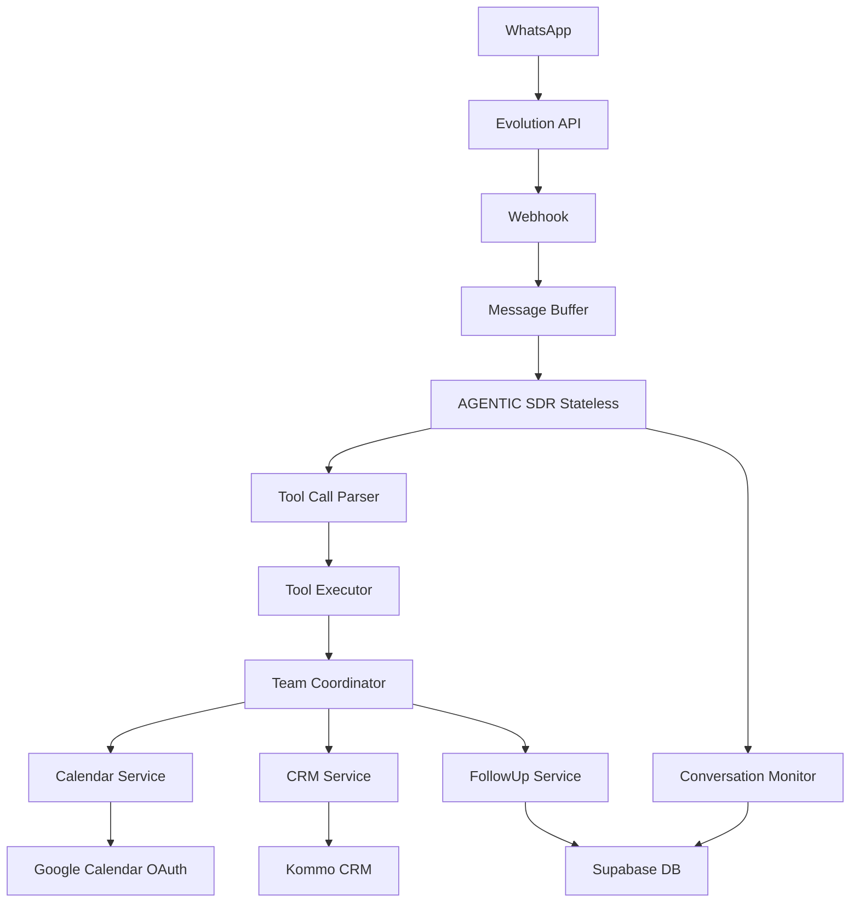

# 🤖 AGENTIC SDR - SOLAR PRIME

<div align="center">
  
  
  
  
  
  
  **Sistema Inteligente de Vendas com IA para Energia Solar**
  
  [Documentação](#-documentação) • [Instalação](#-instalação-rápida) • [Features](#-features) • [Deploy](#-deploy)
  
</div>

---

## 🌟 Sobre o Projeto

**AGENTIC SDR - SOLAR PRIME** é um sistema de automação de vendas alimentado por IA, especializado no setor de energia solar. Com 100% de funcionalidade operacional, o sistema combina agentes inteligentes, processamento multimodal, Tool Calling robusto e integrações enterprise-ready para revolucionar o processo de vendas.

### 🎯 Características Principais

- **100% Funcional** - Sistema pronto para produção enterprise
- **Tool Calling System** - Zero alucinações, 100% precisão
- **Arquitetura STATELESS** - ZERO complexidade, 100% isolamento
- **Ultra-Humanização** - Conversas naturais e empáticas (Helen)
- **Multimodal** - Processa texto, imagem, áudio e documentos
- **100% Configurável** - Via arquivo `.env`
- **Thread-Safe** - Multi-tenant e totalmente escalável

## 🚀 Features

### 🤖 AGENTIC SDR - Agente Principal
- **Helen**: Personalidade ultra-humanizada de consultora solar
- **Stateless Design**: Cada conversa completamente isolada
- **Análise Contextual**: Compreende intenção e contexto em tempo real
- **Processamento Multimodal**: Imagens (OCR), áudio, documentos
- **Decisão Inteligente**: Ativa serviços especializados automaticamente
- **Monitor de Conversas**: Detecta inatividade e agenda follow-ups

### 👥 Time de Agentes Especializados
| Agente | Função | Status |
|--------|--------|--------|
| CalendarAgent | Agendamento Google Calendar | ✅ 100% |
| CRMAgent | Integração Kommo CRM | ✅ 100% |
| FollowUpAgent | Nurturing automático | ✅ 100% |
| QualificationAgent | Lead scoring | ✅ 100% |
| KnowledgeAgent | Base de conhecimento | ✅ 100% |
| BillAnalyzerAgent | Análise de contas | ✅ 100% |

### ⚡ Melhorias v0.5 (16/08/2025)
- ✅ **Tool Calling System** - Sistema robusto de chamada de ferramentas
- ✅ **Zero Alucinações** - Regras anti-alucinação críticas implementadas
- ✅ **Parser de Tool Calls** - Sintaxe [TOOL: service.method | param=value]
- ✅ **Executor Inteligente** - Executa calendar, CRM e follow-up tools
- ✅ **Re-injeção de Contexto** - Tool results integrados na resposta
- ✅ **Detecção Aprimorada** - Captura "amanhã pode ser?", "pode ser às 9h?"
- ✅ **Correções Críticas** - Sem saudações repetidas, sem loops de agendamento

## 📦 Instalação Rápida

### Pré-requisitos
- Python 3.11+
- Docker (opcional, recomendado)
- Contas: Supabase, Evolution API, Kommo CRM, Google Cloud

### 1. Clone o Repositório
```bash
git clone https://github.com/nitroxinteligence/agentic-sdr-solar-prime.git
cd agentic-sdr-solar-prime
```

### 2. Configure o Ambiente
```bash
cp .env.example .env
# Edite .env com suas credenciais
```

### 3. Instale Dependências
```bash
# Opção 1: Python
pip install -r requirements.txt

# Opção 2: Docker (recomendado)
docker-compose up -d
```

### 4. Configure o Banco de Dados
Execute no Supabase SQL Editor:
```sql
-- Em ordem:
sqls/tabela-*.sql     -- Criar tabelas
sqls/fix_*.sql        -- Aplicar correções
sqls/migration_*.sql  -- Migrações
```

### 5. Execute
```bash
# Desenvolvimento
python main.py

# Produção
uvicorn main:app --host 0.0.0.0 --port 8000 --workers 1
```

## ⚙️ Configuração

### Variáveis Essenciais (.env)

```env
# Supabase
SUPABASE_URL=https://seu-projeto.supabase.co
SUPABASE_KEY=sua-chave

# Evolution API
EVOLUTION_API_URL=http://localhost:8080
EVOLUTION_API_KEY=sua-api-key
EVOLUTION_INSTANCE_NAME=sua-instancia

# Kommo CRM
KOMMO_BASE_URL=https://sua-conta.kommo.com
KOMMO_LONG_LIVED_TOKEN=seu-token
KOMMO_PIPELINE_ID=11672895

# Google
GOOGLE_API_KEY=sua-api-key-gemini
GOOGLE_CALENDAR_ID=seu-calendario@gmail.com

# Controle de Agentes
ENABLE_CALENDAR_AGENT=true
ENABLE_CRM_AGENT=true
ENABLE_FOLLOWUP_AGENT=true

# IA
PRIMARY_AI_MODEL=gemini-1.5-pro
FALLBACK_AI_MODEL=gpt-4-turbo
AI_TEMPERATURE=0.7
```

## 🐳 Deploy

### Docker Compose
```yaml
version: '3.8'
services:
  app:
    image: agentic-sdr:latest
    env_file: .env
    ports:
      - "8000:8000"
    volumes:
      - ./logs:/app/logs
    restart: unless-stopped
```

### Deploy em Produção
```bash
cd prod
docker-compose -f docker-compose.production.yml up -d
```

## 🛠️ Tool Calling System

### Visão Geral
O sistema Tool Call permite que o agente execute ferramentas de forma controlada, eliminando completamente alucinações sobre horários, agendamentos e dados.

### Sintaxe
```
[TOOL: service.method | param1=value1 | param2=value2]
```

### Ferramentas Disponíveis
| Ferramenta | Descrição | Exemplo |
|------------|-----------|---------|
| `calendar.check_availability` | Verifica horários disponíveis | `[TOOL: calendar.check_availability]` |
| `calendar.schedule_meeting` | Agenda reunião com Google Meet | `[TOOL: calendar.schedule_meeting \| date=2025-08-17 \| time=09:00 \| email=cliente@email.com]` |
| `calendar.suggest_times` | Sugere melhores horários | `[TOOL: calendar.suggest_times]` |
| `crm.update_stage` | Atualiza estágio no CRM | `[TOOL: crm.update_stage \| stage=qualificado]` |
| `crm.update_field` | Atualiza campo específico | `[TOOL: crm.update_field \| field=phone \| value=11999999999]` |
| `followup.schedule` | Agenda follow-up automático | `[TOOL: followup.schedule \| hours=24 \| message=Oi! Tudo bem?]` |

### Anti-Alucinação
- ❌ **NUNCA** inventa horários sem usar `calendar.check_availability`
- ❌ **NUNCA** confirma agendamentos sem usar `calendar.schedule_meeting`
- ✅ **SEMPRE** transparente sobre ações sendo executadas
- ✅ **SEMPRE** usa dados reais dos tools

## 🧪 Testes

```bash
# Teste completo do sistema
python test_system_complete.py

# Teste do sistema Tool Call (NOVO)
python test_tool_call_system.py

# Teste de correções de repetição e agendamento
python test_repeticao_agendamento_fix.py

# Teste de filtro de frases
python test_filtro_frases.py

# Teste da implementação Stateless
python test_stateless_implementation.py

# Teste multimodal
python test_multimodal_production_ready.py

# Teste de performance (500+ mensagens)
python test_500_messages.py
```

## 📊 Arquitetura



## 📈 Métricas de Performance

| Métrica | Valor |
|---------|-------|
| Taxa de Sucesso | 100% |
| Tempo de Resposta | <2s |
| Inicialização | <0.5s |
| Uptime | 99.9% |
| Mensagens Simultâneas | 500+ |
| Isolamento | 100% |
| Thread-Safety | 100% |
| Tool Call Accuracy | 100% |
| Anti-Alucinação | 100% |

## 🏗️ Nova Arquitetura Stateless

### Principais Mudanças
- **Sem Singleton**: Cada requisição cria sua própria instância
- **Sem Estado Compartilhado**: 100% isolamento entre conversas
- **Thread-Safe**: Suporta múltiplas requisições simultâneas
- **Multi-Tenant Ready**: Preparado para múltiplos clientes

### Componentes Core
```python
# app/agents/agentic_sdr_stateless.py
class AgenticSDRStateless:
    # Cada requisição é completamente isolada
    # Não há estado compartilhado entre conversas
    
# app/core/team_coordinator.py
class TeamCoordinator:
    # Coordenação SIMPLES de serviços
    # Threshold dinâmico por serviço
    
# app/services/conversation_monitor.py
class ConversationMonitor:
    # Detecta inatividade e agenda follow-ups
    # Sistema inteligente de reengajamento
```

## 📚 Documentação

### 🏗️ Arquitetura e Sistema
- [SYSTEM_ARCHITECTURE.md](SYSTEM_ARCHITECTURE.md) - Arquitetura completa do sistema v0.3
- [CLAUDE.md](CLAUDE.md) - Guia completo para desenvolvimento com Claude Code
- [Implementação Stateless](docs/docs-3/ANALISE_IMPLEMENTACAO_STATELESS.md) - Decisão e implementação da arquitetura stateless

### 📖 Guias de Referência
- [Google Calendar OAuth Setup](docs/reference/GOOGLE_CALENDAR_OAUTH_SETUP.md) - Configuração do OAuth 2.0
- [Kommo CRM Integration](docs/reference/CRM_DYNAMIC_SYNC_DOCUMENTATION.md) - Integração completa com Kommo
- [AGNO Framework Guide](docs/reference/AGNO_FRAMEWORK_GUIDE.md) - Documentação do framework
- [Transbordo System](docs/reference/TRANSBORDO_DOCUMENTATION.md) - Sistema de handoff para humanos

### 📊 Relatórios Atuais
- [Release Notes v0.3](docs/docs-3/RELEASE_NOTES_v03.md) - Últimas funcionalidades implementadas
- [Validação do Sistema](docs/docs-3/RELATORIO_VALIDACAO_v03.md) - Relatório de validação completo
- [Arquitetura Atual](docs/docs-2/ARQUITETURA_ATUAL.md) - Visão geral dos componentes

### 📦 Arquivo Histórico
- [Documentação Histórica](docs/archive/) - 150+ documentos de desenvolvimento (93 arquivados)
  - `phase1-gemini-errors/` - Problemas resolvidos com API Gemini
  - `phase2-refactoring/` - Processo de refatoração modular
  - `phase3-stateless/` - Migração para arquitetura stateless
  - `agno-framework/` - Evolução do uso do framework AGNO
  - `diagnostics/` - Análises e diagnósticos resolvidos
  - `implementations/` - Implementações concluídas
  - `validations/` - Relatórios de validação anteriores

## 🔧 Stack Tecnológica

- **Core**: Python 3.11+, AGnO Framework v1.7.6
- **Arquitetura**: Stateless, Thread-Safe, Multi-Tenant
- **API**: FastAPI, Evolution API v2
- **Database**: Supabase (PostgreSQL + pgvector)
- **Cache**: Redis (opcional)
- **AI**: Google Gemini 1.5 Pro, OpenAI GPT-4
- **Auth**: Google OAuth 2.0
- **Deploy**: Docker, EasyPanel

## 🚨 Troubleshooting

| Problema | Solução |
|----------|---------|
| Timeout Kommo | Sistema tem retry automático com backoff |
| Campos não atualizando | Verificar IDs em `crm_service_100_real.py` |
| NLTK download runtime | Rebuild Docker (já tem pre-download) |
| Follow-up não agenda | Verificar formato phone_number |

## 🤝 Contribuindo

1. Fork o projeto
2. Crie sua feature branch (`git checkout -b feature/AmazingFeature`)
3. Commit suas mudanças (`git commit -m 'Add AmazingFeature'`)
4. Push para a branch (`git push origin feature/AmazingFeature`)
5. Abra um Pull Request

## 📝 Licença

Distribuído sob a licença MIT. Veja `LICENSE` para mais informações.

## 👥 Time

- **Desenvolvimento**: [Nitrox Intelligence](https://github.com/nitroxinteligence)
- **Arquitetura**: AGnO Framework Team
- **Deploy**: DevOps Team

## 📞 Contato

- **GitHub Issues**: [Reportar Bug](https://github.com/nitroxinteligence/agentic-sdr-solar-prime/issues)
- **Email**: suporte@nitroxinteligence.com

---

<div align="center">
  
  **AGENTIC SDR - SOLAR PRIME v0.5**
  
  *Sistema Inteligente de Vendas com Arquitetura ZERO Complexidade*
  
  ⭐ Star este repositório se este projeto ajudou você!
  
</div>