# 🤖 Agentic SDR - SolarPrime

<div align="center">
  
  
  
  
  
  
  **Sistema Inteligente de Vendas com IA para Energia Solar**
  
  [Documentação](#-documentação) • [Instalação](#-instalação-rápida) • [Features](#-features) • [Deploy](#-deploy)
  
</div>

---

## 🌟 Sobre o Projeto

**Agentic SDR - SolarPrime** é um sistema de automação de vendas alimentado por IA, especializado no setor de energia solar. Com 100% de funcionalidade operacional, o sistema combina um agente inteligente (Helen Vieira), processamento multimodal, um robusto sistema de `Tool Calling` e integrações `enterprise-ready` para revolucionar o processo de qualificação e vendas.

### 🎯 Características Principais

- **100% Funcional**: Sistema pronto para produção.
- **Arquitetura STATELESS**: Garante escalabilidade, robustez e total isolamento entre conversas.
- **Tool Calling System**: Zero alucinações em tarefas críticas. O agente usa ferramentas para interagir com sistemas externos, garantindo 100% de precisão.
- **Ultra-Humanização**: A agente "Helen" possui uma personalidade empática, com identidade regional e inteligência emocional para criar conversas naturais.
- **Multimodal**: Processa texto, imagem (OCR de contas de luz) e áudio (transcrição).
- **100% Configurável**: Todo o comportamento do sistema é controlado via arquivo `.env`.
- **Thread-Safe**: Projetado para alta concorrência, capaz de gerenciar múltiplos leads simultaneamente sem conflitos.

## 🚀 Features

### 🤖 Agente Principal (AgenticSDRStateless)
- **Helen Vieira**: Persona ultra-humanizada de uma consultora sênior da SolarPrime.
- **Design Stateless**: Cada mensagem cria uma nova instância do agente, garantindo isolamento total.
- **Análise de Contexto**: Compreende intenção, sentimento e extrai informações relevantes em tempo real.
- **Processamento Multimodal**: Extrai dados de imagens (contas de luz) e transcreve mensagens de áudio.
- **Sistema de Ferramentas**: Ativa serviços especializados (Calendário, CRM, Follow-up) de forma autônoma e precisa.
- **Base de Conhecimento**: Consulta o Supabase para responder a perguntas técnicas e sobre objeções, garantindo consistência.

### 🛠️ Serviços Integrados
| Serviço | Função | Status |
|---|---|---|
| **CalendarService** | Agendamento, reagendamento e cancelamento no Google Calendar via OAuth 2.0, com criação de links do Google Meet. | ✅ 100% |
| **CRMService** | Sincronização completa com Kommo CRM: criação/atualização de leads, mudança de estágios e adição de tags. | ✅ 100% |
| **FollowUpService** | Agendamento de mensagens de acompanhamento (follow-ups) através do Supabase e Redis. | ✅ 100% |
| **MultimodalProcessor**| Processa mídias como áudio e imagens para extração de texto. | ✅ 100% |
| **ModelManager** | Gerencia a comunicação com os LLMs (Gemini), incluindo a lógica de retry e fallback. | ✅ 100% |

## 📁 Estrutura do Projeto

```
├── app/                    # Código principal da aplicação
│   ├── agents/            # Agentes IA (AgenticSDRStateless)
│   ├── api/               # Endpoints FastAPI
│   ├── services/          # Serviços integrados (Calendar, CRM, etc.)
│   └── utils/             # Utilitários e helpers
├── docs/                  # Documentação do projeto
│   └── archive/           # Documentação histórica/obsoleta
├── sqls/                  # Scripts SQL para setup do banco
├── test_*.py              # Testes automatizados
├── main.py                # Ponto de entrada da aplicação
├── docker-compose.yml     # Configuração Docker
└── .env                   # Variáveis de ambiente
```

### 📚 Documentação Arquivada

A pasta `docs/archive/` contém documentação histórica e diagnósticos de correções implementadas:
- Diagnósticos de erros corrigidos (DIAGNOSTICO_*.md)
- PRDs de correções específicas
- Guias de troubleshooting antigos
- Documentação de agentes descontinuados

## 📦 Instalação Rápida

### Pré-requisitos
- Python 3.9+
- Docker e Docker Compose
- Contas: Supabase, Evolution API, Kommo CRM, Google Cloud (com OAuth 2.0 configurado)

### 1. Clone o Repositório
```bash
git clone <URL_DO_REPOSITORIO>
cd agent-sdr-ia-solarprime
```

### 2. Configure o Ambiente
- Renomeie `.env.example` para `.env`.
- Preencha **todas** as variáveis de ambiente com suas credenciais.

### 3. Instale Dependências e Execute com Docker (Recomendado)
```bash
docker-compose up --build -d
```

### 4. Configure o Banco de Dados
- Acesse o SQL Editor do seu projeto Supabase.
- Execute os scripts da pasta `sqls/` na ordem correta para criar e popular as tabelas necessárias.

### 5. Acompanhe os Logs
```bash
docker-compose logs -f
```

## ⚙️ Configuração Essencial (.env)

```env
# Supabase
SUPABASE_URL=https://seu-projeto.supabase.co
SUPABASE_KEY=sua-chave-anon

# Evolution API (WhatsApp)
EVOLUTION_API_URL=http://localhost:8080
EVOLUTION_API_KEY=sua-api-key
EVOLUTION_INSTANCE_NAME=sua-instancia

# Kommo CRM
KOMMO_BASE_URL=https://sua-conta.kommo.com
KOMMO_LONG_LIVED_TOKEN=seu-token-de-longa-duração
KOMMO_PIPELINE_ID=123456

# Google (OAuth 2.0 é crucial para o calendário)
GOOGLE_API_KEY=sua-api-key-gemini
GOOGLE_CALENDAR_ID=seu-calendario@gmail.com
GOOGLE_OAUTH_CLIENT_ID=seu-client-id
GOOGLE_OAUTH_CLIENT_SECRET=seu-client-secret
GOOGLE_OAUTH_REFRESH_TOKEN=seu-refresh-token-obtido-via-script

# IA
PRIMARY_AI_MODEL=gemini-1.5-pro
AI_TEMPERATURE=0.7
```

## 🛠️ Sistema de Tool Calling

O agente utiliza um sistema de chamada de ferramentas para interagir com o mundo real, eliminando alucinações.

### Sintaxe
`[TOOL: service.method | param1=value1 | param2=value2]`

### Ferramentas Disponíveis
| Ferramenta | Descrição | Exemplo |
|---|---|---|
| `calendar.check_availability` | Verifica horários disponíveis para uma data. | `[TOOL: calendar.check_availability \| date_request=2025-08-25]` |
| `calendar.schedule_meeting` | Agenda uma reunião com link do Google Meet. | `[TOOL: calendar.schedule_meeting \| date=2025-08-25 \| time=10:00]` |
| `calendar.reschedule_meeting`| Reagenda a última reunião do lead. | `[TOOL: calendar.reschedule_meeting \| date=2025-08-26 \| time=11:00]` |
| `calendar.cancel_meeting` | Cancela a última reunião agendada. | `[TOOL: calendar.cancel_meeting]` |
| `crm.update_stage` | Atualiza o estágio do lead no funil do Kommo. | `[TOOL: crm.update_stage \| stage_name=reuniao_agendada]` |
| `crm.update_lead` | Atualiza campos específicos do lead no Kommo. | `[TOOL: crm.update_lead \| bill_value=500]` |
| `followup.schedule_followup` | Agenda uma mensagem de acompanhamento. | `[TOOL: followup.schedule_followup \| delay_hours=24 \| message=Oi! Tudo bem?]` |
| `knowledge.search` | Busca informações na base de conhecimento. | `[TOOL: knowledge.search \| query=qual a garantia das placas?]` |

## 📊 Arquitetura

```mermaid
graph TD
    subgraph "Usuário"
        WhatsApp
    end

    subgraph "Infraestrutura"
        Evolution[Evolution API]
        FastAPI[FastAPI App]
        Supabase[Supabase DB]
        Redis[Redis Cache/Lock]
        Kommo[Kommo CRM]
        Google[Google Calendar]
    end

    subgraph "Aplicação"
        Webhook[API Webhook]
        Buffer[Message Buffer]
        Agent[AgenticSDR Stateless]
        Model[Model Manager]
        Tools[Tool Executor]
        Services[Calendar/CRM/FollowUp Services]
    end

    WhatsApp --> Evolution
    Evolution --> Webhook
    Webhook --> Buffer
    Buffer --> Agent
    Agent --> Model
    Agent --> Tools
    Tools --> Services
    Services --> Kommo
    Services --> Google
    Agent -- Contexto --> Supabase
    Agent -- Cache/Lock --> Redis
```



## 🔧 Stack Tecnológica

- **Core**: Python 3.9+, FastAPI
- **Arquitetura**: 100% Stateless, Orientada a Serviços
- **API Gateway**: Evolution API (WhatsApp)
- **Banco de Dados**: Supabase (PostgreSQL)
- **Cache & Locks**: Redis
- **IA**: Google Gemini 1.5 Pro
- **Autenticação**: Google OAuth 2.0 (para Calendário)
- **CRM**: Kommo
- **Deploy**: Docker, Docker Compose

## 🧪 Testes

O projeto mantém dois conjuntos de testes essenciais:

### Testes Principais
- **`test_integrated_real_systems.py`**: Testes de integração com sistemas reais (Supabase, Kommo, Google)
- **`test_real_scenarios.py`**: Testes de cenários reais de uso do sistema

### Executar Testes
```bash
# Teste de integração com sistemas reais
python test_integrated_real_systems.py

# Teste de cenários reais
python test_real_scenarios.py
```

### Status dos Testes
- ✅ **test_integrated_real_systems.py**: 5/5 testes passando (100%)
- ✅ **test_real_scenarios.py**: 8/8 cenários passando (100%)
- ✅ **Sistema 100% funcional** após limpeza do codebase

## 🤝 Contribuindo

1.  Faça um Fork do projeto.
2.  Crie sua Feature Branch (`git checkout -b feature/AmazingFeature`).
3.  Faça o Commit de suas mudanças (`git commit -m 'Add some AmazingFeature'`).
4.  Faça o Push para a Branch (`git push origin feature/AmazingFeature`).
5.  Abra um Pull Request.

## 📝 Licença

Distribuído sob a licença MIT. Veja `LICENSE` para mais informações.
